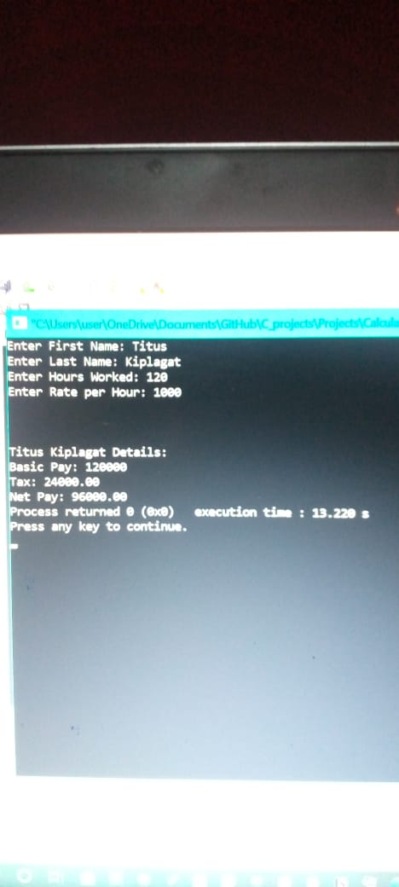

##  CALCULATE NET PAY
***
This is a sample program to calculate the net pay for a given employee and display 
### How its calculated
> basic pay = hours worked by employee * rate per hour
|  Basic Pay | Tax |
|Over 50000|20 % of basic pay|
|Between 20000 and 50000|10 % of basic pay|
|Below 20000|No discount|
### Decription
`Struct` is used to store user's information.  
#### Functions
`taxPaid(bsPay);`  
Calculates tax paid depending with the basic pay table above.  
`basicPay();`  
Calculates basic pay by the hours worked and rate per hour.  
`employeeInput();`  
Takes user Employee and stores it in the structre  
`calcNetPay();`  
Calculates net pay by subtracting Tax from Basic Pay
## Sample output

***
## Conslusion
Documented and written  by [Titus Kiplagat](https://www.linkedin.com/in/titus-kiplagat-5146ba210/)
